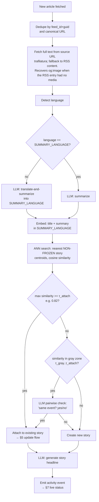

# NewsGator — Technical Specification

> Status: **DRAFT — for review & refinement before implementation**

## 1. Goal

A self-hosted news reader that does **not** show a flat list of articles. Instead, it
groups articles from different RSS feeds that talk about the **same story** into a single
"story cluster", uses a **local OpenAI-compatible LLM** to summarize the cluster, and
links back to each original article.

### Core user stories

1. Fetch RSS feeds on a schedule during the day.
2. For each new article: embed it, summarize it, categorize it (local AI, OpenAI-compatible API).
3. Group articles covering the same event into one **Story** with a merged summary + links to sources.
4. When a *new* article arrives for an *existing* story (possibly in another language):
   - attach it to the story,
   - update the merged summary if it adds new information,
   - if the user already read the story, do **not** re-surface it as unread — flag it as
     **"read, updated since"**.
5. Web GUI to browse stories (not articles), mark read/unread, drill into sources.

**Language policy:** all summaries are written in a **user-configured summary language**
(`SUMMARY_LANGUAGE`, e.g. `en`, `fr`, `de`) — one language for everything, chosen by the
user, not hardcoded to English. The GUI itself (labels, buttons, navigation) is
**English-only for v1**. Article embeddings are computed from the summary-language text so
clustering stays consistent regardless of source language.

**Multi-user from day one:** accounts with per-user read state and per-user settings.
Small user count (family/friends scale) — no org/team concepts.

Non-goals (v1): non-RSS sources (kept pluggable), mobile app, localized GUI, notifications.

---

## 2. High-level architecture

```
┌─────────────┐   poll    ┌──────────────┐   OpenAI-compatible HTTP   ┌──────────────┐
│ RSS feeds    │ ────────▶ │  Ingestion    │ ────────────────────────▶ │  Local LLM    │
└─────────────┘           │  pipeline     │  (embeddings + chat)      │  (e.g. Ollama │
                          └──────┬───────┘                           │  llama.cpp,   │
                                 │                                    │  LM Studio…)  │
                                 ▼                                    └──────────────┘
                          ┌──────────────┐
                          │  SQLite +     │
                          │  vector index │
                          └──────┬───────┘
                                 ▼
                          ┌──────────────┐   REST/JSON   ┌──────────────┐
                          │  Backend API  │ ◀───────────▶ │   Web GUI     │
                          └──────────────┘               └──────────────┘
```

### Stack (confirmed)

| Concern | Decision | Why |
|---|---|---|
| Language | Python 3.12 | best ecosystem for RSS + AI glue |
| RSS parsing | `feedparser` | battle-tested |
| Full-text extraction | `trafilatura` (fallback: `readability-lxml`) | most feeds ship excerpts only |
| Scheduling | `APScheduler` (in-process) | no external broker needed |
| Relational DB | SQLite via SQLAlchemy | single-file, zero-ops |
| Vector store | `sqlite-vec` **by default**; **Qdrant as optional backend** behind a small store abstraction | zero-ops default, scale-out option for the user's existing Qdrant |
| LLM | OpenAI-compatible client pointed at an **external** server (`LLM_BASE_URL`) | LLM serving is out of scope (user runs oMLX on LAN) |
| Backend | FastAPI | async, auto OpenAPI docs |
| Frontend | **SvelteKit** SPA talking to the REST API | user choice |
| Auth | local accounts, argon2 hashes, session cookies | small user count, keep simple |
| Migrations | Alembic | cheap insurance |
| Packaging | Docker + docker-compose (Qdrant as optional compose service) | user deployment target |

---

## 3. Data model

```mermaid
erDiagram
    USER ||--o{ STORY_STATE : "has per-story state"
    FEED ||--o{ ARTICLE : produces
    STORY ||--o{ ARTICLE : groups
    STORY ||--o{ STORY_REVISION : "history"

    USER {
        int id PK
        string username
        string password_hash  "argon2"
        bool   is_admin
        string summary_language  "per-user override, default from global config"
        datetime created_at
    }

    FEED {
        int id PK
        string url           "RSS URL, or pseudo-URL newsletter:{sender} for mail feeds"
        string kind          "rss|mail — mail feeds are never RSS-polled"
        string sender_email  "mail feeds only: the newsletter From: address"
        string title
        int poll_interval_min
        int backfill_days   "first-poll window; NULL = server default, 0 = all"
        datetime last_fetched_at
        string etag
        string last_modified
    }

    ARTICLE {
        int id PK
        int feed_id FK
        string guid          "dedupe key (feed_id, guid)"
        string url
        string title
        string image_url   "first RSS image: media:content → media:thumbnail → image enclosure
                            → first real <img> in the entry HTML (skips pixels/emoji and
                            lazy-load placeholder srcs like placeholder.svg — the real URL
                            lives in data-src, which feedparser's sanitizer strips);
                            else og:image recovered from the page during full-text fetch"
        text   raw_content   "from RSS (newsletter intro for mail feeds)"
        text   full_text     "fetched from source page (trafilatura)"
        string language      "ISO 639-1, detected"
        text   summary       "per-article, in SUMMARY_LANGUAGE"
        text   newsletter_intro "mail feeds only: human-written intro from the email;
                               preferred over the LLM summary when a NEW story is
                               created from this article"
        string category
        blob   embedding     "float32 (sqlite-vec) or external id (Qdrant)"
        int    story_id FK   "nullable until clustered"
        string processing_state "fetched|fulltext|summarized|embedded|clustered"
        string content_status   "full|partial"
        string content_warning  "e.g. 'requires credentials'"
        datetime published_at
        datetime fetched_at
    }

    STORY {
        int id PK
        string title          "LLM-generated headline, in SUMMARY_LANGUAGE"
        text   summary        "merged summary, in SUMMARY_LANGUAGE"
        string category
        string image_url      "lead image: first member article with an image
                               (RSS media / inline <img>, else og:image from the page)"
        blob   centroid       "recency-weighted mean of member embeddings"
        int    version        "bumped on every content change"
        bool   is_frozen      "true after freeze window; no new auto-attachments"
        datetime first_seen_at
        datetime last_updated_at
    }

    STORY_STATE {
        int user_id PK, FK
        int story_id PK, FK
        bool   is_read
        int    read_at_version  "story.version when user read it"
        datetime read_at
    }

    STORY_REVISION {
        int story_id FK
        int version
        text summary
        datetime created_at
    }

    LLM_USAGE {
        int id PK
        datetime ts
        string kind           "summarize|embed|cluster_embed|pairwise|novelty|headline|merge|share_translate|backfill_embed|newsletter_clean|newsletter_extract"
        string endpoint       "chat|embed"
        string model
        int prompt_tokens     "nullable — from the OpenAI `usage` object"
        int completion_tokens "nullable"
        int total_tokens      "nullable"
        int cached_tokens     "nullable, when the server reports prompt caching"
        int reasoning_tokens  "nullable, when the server reports reasoning"
        bool estimated        "true when the server omitted `usage` → chars/4 heuristic"
        int latency_ms
        int article_id        "no FK — metrics survive retention"
        int story_id          "no FK"
        int feed_id           "no FK, denormalized at insert for per-source stats"
    }

    MAIL_ACCOUNT {
        int id PK
        int user_id FK        "per-user IMAP inbox (§9 newsletter ingestion)"
        string host
        int port              "default 993"
        string username
        string password       "write-only via the API; stored in clear like other secrets"
        string folder         "mandatory — the folder receiving newsletters"
        bool   use_ssl
        bool   is_enabled
        int    last_uid       "IMAP UID watermark — only newer messages are processed"
        datetime last_checked_at
        string last_error
        datetime created_at
    }
```



`LLM_USAGE` is append-only and **never purged by retention** — one row per external
LLM call, full history is the point (cloud-readiness metrics). Cost estimation is a
GUI-side playground (prices entered on the Usage page, never a server setting).

### Key derived flag

`updated_since_read(user, story) = is_read AND story.version > story_state.read_at_version`

This directly implements the requirement: *"if I already read it, I do not need to see it
again... it could be flagged as (read, but updated since that)"*. The story stays visually
"read" for that user but gets a badge; no unread count inflation.

---

## 4. Processing pipeline

Per poll cycle, for each new article:



Every pipeline stage transition (feed poll started/finished, full-text fetched via which
path, summary started/done, embedding done, clustering decision + similarity score, story
summary regenerated) is emitted as an **activity event** to the in-app activity log and
the SSE stream (§7).

**Why embeddings in the summary language:** summarizing to one configured language first
(default `en`, chosen at first setup) and embedding that text gives one consistent vector
space, so a French article and an English article about the same iPhone launch still land
next to each other. A multilingual
embedding model is an alternative (keeps raw-language vectors comparable), but mixing
languages per-article in one space is not acceptable — whatever the choice, **all
embeddings must be produced the same way**. Decision: summary-language embeddings
(multilingual-embedding alternative rejected). The
original-language text stays stored and linked.

**Two-threshold clustering:** pure cosine similarity is noisy; a cheap LLM yes/no
confirmation only in the gray zone keeps accuracy up without paying an LLM call per pair.

---

## 5. The "third article arrives later" flow

When article C attaches to existing story S:

1. **Attach**: set `article.story_id = S.id`; recompute `S.centroid` as the running mean
   of member embeddings.
2. **Novelty check** (cheap LLM call): *"Given the current story summary and this new
   article summary, does the article add new facts?"*
   - **No new info** → add source link, bump `last_updated_at`, **do not** bump
     `S.version`. Read users see nothing change.
   - **New info** → LLM regenerates the merged summary **and refreshes the headline**
     in the same call (new facts may shift the story's angle), bump `S.version`.
3. **Read-state consequence** (via the derived flag in §3):
   - Unread story → stays unread, appears with fresh content.
   - Read story, version bumped → badge **"updated since read"**; user can open a
     **diff/changelog view** showing what was added (store per-version summary history
     in a `STORY_REVISION` table — optional v1, recommended).
   - Read story, no new info → nothing surfaces.

### Version history (recommended)

```
STORY_REVISION(story_id FK, version, summary, created_at)
```
Enables "what changed since I read it" — a genuinely useful view and cheap to store.

### Cluster aging (freezing)

Stories **auto-freeze** `FREEZE_AFTER_HOURS` (default 72, GUI-configurable) after
`first_seen_at`. Rationale: an article about "the iPhone" arriving 3 days later is usually
a *different angle* (review, analysis, follow-up), not the same breaking news.

- Frozen stories are excluded from ANN candidate search → a near-match to a frozen story
  creates a **new** story instead of attaching.
- The LLM may mark the new story as **related** to the frozen one
  (`related_story_ids`), so the UI can cross-link without merging.
- Manual attach to a frozen story stays possible via the merge UI.

### Centroid drift

Endorsed as a feature: the centroid drifting toward the "consensus" meaning of the story
is desirable. Guardrails:

- **Recency-weighted running mean** (half-life ~24h) so the centroid evolves with the
  newest reporting instead of being anchored to the first article.
- Nightly recompute from member embeddings to eliminate accumulated float error.
- Embedding dimensionality is tied to `EMBED_MODEL`; changing the embedding model
  requires a full re-embed job (same warning flow as changing `SUMMARY_LANGUAGE`).

### Feedback loop (threshold tuning)

v1 is **data-first, no online learning**:

1. Log every clustering decision (article, candidate story, similarity, gray-zone LLM
   verdict, action taken).
2. User corrections (manual merge / split / move) are stored as **labeled pairs**:
   "same story" / "different story".
3. An admin report replays logged pairs against candidate τ values → precision/recall
   curves → *suggested* thresholds, applied only on human confirmation.
4. Later option: inject confirmed "same event" pairs as few-shot examples into the
   pairwise check prompt.

---

## 6. API surface (backend → GUI)

| Endpoint | Purpose |
|---|---|
| `POST /auth/login`, `POST /auth/logout` | session auth; login/setup also return the signed token in the body — clients that cannot persist cookies (iOS standalone PWAs) send it as `Authorization: Bearer <token>` (or `?token=` for SSE) |
| `POST /auth/session-token` | issue a fresh portable token for the authenticated user — for flows that can't use cookies/headers (RSS readers on `/feed.xml`); works even when the client lost its localStorage token mid-session (valid cookie suffices) |
| `GET/PATCH /me` | profile + per-user preferences: summary language, story-list filter (`story_filter`, default `unread`) and ordering (`story_sort`/`story_order`) — shared across the user's devices |
| `GET /users`, `POST /users`, `PATCH /users/{id}`, `DELETE /users/{id}` | user management (admin): list, create (username/password/admin flag), reset password or toggle admin, delete. First-run `/auth/setup` only creates the initial admin; additional users come from here. Guards: the last admin can be neither demoted nor deleted, and a user cannot delete themselves; deleting a user bulk-removes their `STORY_STATE` rows |
| `GET /stories?filter=all\|unread\|updated&category=&feed=&sort=updated\|published\|sources&order=asc\|desc` | story list with **per-user** flags; `feed` keeps only stories with at least one source article from that feed; sort by article publication date (default), last update, or source count, ascending (default: oldest first) or descending; unknown dates always last |
| `GET /stories/feed-options` | feeds that have at least one article in a story (`[{id, title, kind, url, sender_email}]`) — options for the story-list feed filter. Any authenticated user (feeds CRUD itself is admin-only) |
| `GET /stories/{id}` | story detail: merged summary + source articles + revision history |
| `POST /stories/{id}/read` | sets `read_at_version = story.version` (per user) |
| `POST /stories/{id}/unread` | |
| `GET /stories/{id}/diff?from={version}` | what changed |
| `CRUD /feeds` | feed management (admin); `GET /feeds` also reports `story_count` / `unread_story_count` per feed (stories with a source from it; unread is per the requesting user). **Creating a feed kicks an immediate background poll** (no waiting for the next scheduler tick) |
| `POST /feeds/import-opml` | bulk-import feeds from an OPML subscription export (admin); added feeds are polled immediately in the background |
| `POST /feeds/{id}/refresh`, `POST /feeds/refresh` | force-poll one/all RSS feeds now, bypassing the adaptive schedule (admin); mail feeds are rejected — they are refreshed by polling the mail account |
| `GET/POST /mail-accounts`, `PATCH/DELETE /mail-accounts/{id}` | per-user IMAP accounts for newsletter ingestion (any user, own accounts only — 404 across users). Folder is mandatory; the password is write-only (never returned, replace via PATCH). Deleting an account keeps the mail feeds/articles it produced |
| `POST /mail-accounts/{id}/test`, `POST /mail-accounts/{id}/poll` | probe IMAP login + folder existence (returns ok/errors, never the password), or poll the account immediately (202 + message count; **409 when a poll is already running** for that account) |
| `GET/PATCH /settings` | global: retention days, freeze window, thresholds, vector backend (admin). Precedence: **env var > DB override > code default**; env-set keys are reported in `env_locked`, shown read-only in the GUI, and rejected by PATCH |
| `POST /settings/test-llm`, `POST /settings/test-qdrant`, `POST /settings/test-readeck` | connection probes for the external services (admin); return `ok` + errors without leaking secrets |
| `POST /stories/{id}/merge` / `POST /articles/{id}/move` | manual override when clustering is wrong (important for trust) |
| `GET /stories/{id}/similar`, `GET /stories/articles/{id}/similar-stories` | ranked merge/move candidates for the story-detail pickers: ANN over story centroids then exact cosine re-rank, `[{id, title, similarity}]` best-first, self/current story excluded; stories/articles without vectors fall back to unscored recency order (`similarity: null`). Read-only probes — no activity events |
| `POST /stories/{id}/readeck` | push the story to Readeck as a permanent, self-contained bookmark (headline + summary + all source links as uploaded HTML; canonical `url` = primary source article). 404 when Readeck isn't configured; 502 on upstream failure. On success the bookmark UID is stored on `story.readeck_bookmark_id` (surfaced in list + detail so the GUI can grey out the button). Optional — enabled only when both `READECK_BASE_URL` and `READECK_TOKEN` are set (env or settings override) |
| `GET /stories/share-languages` | languages offered by the share picker (from `SHARE_LANGUAGES`, ISO codes filtered to known names) + the current summary language |
| `POST /stories/{id}/share` | build the share card (headline + merged summary + all source links; `url` = primary source article) for the client-side Web Share API / clipboard. Body `{language}` = ISO code for on-demand LLM translation of headline + summary; null/omitted = share as-is (no LLM call). Always available — nothing to configure. 400 on unsupported language or incomplete translation, 502 on LLM failure |
| `POST /chat` | chatbot (RAG over the story archive): body `{question}`; the question is embedded with `EMBED_MODEL`, matched against story centroids (ANN + exact cosine re-rank), and the top-`CHAT_TOP_K` story summaries ground the answer. Returns `{answer, stories[], latency_ms}` — each story carries `id/title/category/image_url/last_updated_at/source_hosts/similarity/cited` so the GUI renders clickable citations. 404 when `CHAT_ENABLED` is off, 502 on embed/LLM failure. Each turn (question + answer) is persisted per user so history follows them across devices |
| `GET /chat/history`, `DELETE /chat/history` | per-user chat history (server-side, cross-device): list turns oldest-first (assistant rows carry their citation cards), or wipe it (the GUI Clear button) |
| `GET /health`, `GET /stats` | ops |
| `GET /usage/summary?period=day\|month\|all`, `GET /usage/daily?days=`, `GET /usage/by-feed` | LLM token-usage metrics (admin): totals + per-kind/per-model breakdowns with throughput (tok/s), per-day series, per-source-feed history. Token counts flagged `estimated` when the server omitted `usage` |
| `GET /favicon?host=` | cached favicon proxy for source logos and feed icons (auth required; never a third-party favicon service — cache TTL via `FAVICON_CACHE_HOURS`). Fetch chain: `/favicon.ico`, then the homepage's `<link rel=icon>`, then parent domains (newsletter senders are often subdomains like `mail.example.com` with no icon of their own; never strips below two labels) |
| `GET /feed.xml?category=&unread=1&limit=` | the story archive as an RSS 2.0 feed — each item is one story (headline, merged summary, lead image as `media:content`, primary source article as link). guid is the stable `story:{id}`; `pubDate` is the original article publication date and `atom:updated` tracks the latest revision date, so a version bump marks the item updated without re-notifying it. Auth via `?token=` (RSS readers can't set headers) |

Manual merge/split is a deliberate feature: clustering *will* be wrong sometimes, and the
user must be able to fix it. Corrections can later feed threshold tuning.

---

## 7. Web GUI (concept)

- **Main view**: story cards (headline, lead image thumbnail, merged summary,
  category chip, source favicons/logos (via the cached `/favicon` proxy)
  ×N, age, badges: `NEW` / `UPDATED`), default filter **Unread** (per-user
  overridable, persisted server-side), default-sorted by article publication date
  (oldest first — per-user overridable, persisted server-side) with read stories
  dimmed or in a separate tab. All story content is in the configured `SUMMARY_LANGUAGE`;
  GUI chrome (labels, buttons) is English-only in v1. The title and filter bar
  are sticky: story cards scroll behind them, and marking a story read in the
  desktop list smooth-scrolls down so the dimmed card slides out behind the
  header and the next story takes its place. On narrow screens the main
  view is a card deck: swipe left marks the story read and opens the next one,
  swipe right goes back to the previous one.
- **Story view**: merged summary, "what changed" accordion (revisions), list of source
  articles with language flag + per-article summary + external link.
- **Feed management page**: add/remove feeds, poll status, last errors.
- **Settings page**: per-user summary-language selector; admin section for LLM
  endpoints/models, clustering thresholds, freeze window, retention days, vector backend
  (sqlite-vec vs Qdrant).
- **Activity page (admin)**: live stream of backend operations — feed polls, full-text
  fetches (and which fallback path was used), LLM summarization in progress, clustering
  decisions, errors — backed by the SSE endpoint below. A live "LLM interactions"
  panel shows each in-flight LLM call with its prompt and (once finished) its reply
  — see the observability section below. A compact "now processing"
  indicator is also visible in the main story view.
- **Usage page (admin)**: LLM token-usage dashboard — today / this month / all-time
  cards, per-day chart, per-stage / per-model / per-feed tables with tok/s throughput,
  and a client-side price playground ($ per 1M tokens, localStorage) projecting what
  the same usage would cost on a cloud provider. A warning banner shows the share of
  calls whose token counts were estimated (server returned no `usage` object).
- Filters: category, unread / updated-since-read, language of sources.

---

## 7. Live activity / observability

The GUI must show what the backend is doing ("refreshing feed XYZ", "summarizing with
LLM", …) in near real time.

- **Transport**: Server-Sent Events at `GET /activity/stream` (one-way server→client;
  simpler and more firewall/proxy-friendly than WebSockets; SvelteKit consumes it with
  `EventSource`).
- **Persistence**: an `ACTIVITY_LOG` table (capped ring buffer, e.g. last 5k events) so
  the Activity page can show recent history, not just the live tail.
- **Event shape**:

```json
{
  "ts": "2026-08-24T10:15:30Z",
  "level": "info|warn|error",
  "component": "ingest|fulltext|llm|cluster|retention",
  "action": "feed_poll_start|feed_poll_done|fulltext_fetch|summarize_start|summarize_done|embed_done|cluster_attach|cluster_new|story_update|feed_disabled|...",
  "detail": {"feed": "The Verge", "article_id": 123, "similarity": 0.87, "llm_ms": 1820}
}
```

- **LLM queue visibility**: the summarization/embedding work goes through a small
  in-process queue; the activity stream includes queue depth so the GUI can show
  "3 articles waiting for LLM". The depth counts queued articles **plus the one
  currently being processed** (once the worker dequeues an article, the raw queue
  size would read 0 even though the LLM is busy).
- **LLM interaction trace**: every external LLM call (chat + embeddings) is captured
  in an in-memory ring (last 100 calls; deliberately NOT persisted — prompts carry
  full article text and would bloat ACTIVITY_LOG). Each record carries the call kind
  (summarize/embed/pairwise/novelty/headline/merge/newsletter_clean/newsletter_extract/chat_*/
  share_translate/probe/other), a human label + article id, the truncated system/user
  prompts (or embedding input stats), then the raw reply, latency, token usage and
  attempt count. Records are broadcast live over the activity stream as
  `llm_interaction` payloads (status running → done|error) and snapshotted via
  `GET /activity/llm` for the Activity page's initial load. Call sites annotate the
  current call through a task-local context (no signature changes to the LLM client).
  Config: `LLM_TRACE_ENABLED` (default on), `LLM_TRACE_MAX_CHARS` (per-field clamp).
- Also exposed: `GET /activity/recent` for the page's initial load.

---

## 8. LLM integration details

- Config: `LLM_BASE_URL`, `LLM_MODEL`, `EMBED_MODEL`, `LLM_API_KEY` (dummy ok),
  `SUMMARY_LANGUAGE` (e.g. `en`, `fr`, `de`) — all LLM prompts are generated with the
  target language injected ("Summarize the following article in French…").
- Calls needed: `chat.completions` (summarize, headline, novelty check, pairwise confirm,
  category) and `embeddings`.
- All prompts request **structured JSON output**; validate + retry once on parse failure.
- Every LLM call is idempotent-ish and stored (article.summary, story.summary), so
  pipeline steps are resumable after failure — store per-article `processing_state`
  (`fetched → summarized → embedded → clustered`). Articles are handed to the LLM
  queue only after their state commit; a periodic backlog sweep
  (`BACKLOG_SWEEP_MINUTES`, default 5) requeues anything stuck in `fulltext`
  (LLM failure, lost queue item), on top of the startup requeue.
- Categories: **user-customizable taxonomy** — a seed list (Tech, World, Science,
  Business, Sports, Culture, Politics, Health) is created at install, but admins can
  add/rename/remove categories in the GUI; the constrained-choice LLM prompt is built
  from the *current* taxonomy at call time. Renaming a category relabels existing items
  (cheap); deleting moves items to `Uncategorized`.
- **Changing `SUMMARY_LANGUAGE` after data exists** requires re-summarizing and
  re-embedding everything (embeddings are in the summary language's vector space).
  Warn the user and run it as a background reprocessing job.

### Model recommendations (baseline: Apple M1 Max, 64 GB RAM, MLX-served)

The LLM server is external to this project; these are sizing suggestions for that
hardware budget:

- **Chat / summarization:** a 32B-class instruct model at 4-bit (~18–20 GB), e.g.
  Qwen2.5/3-32B-Instruct; or Mistral-Small-3.x-24B if latency matters. Prioritize
  **multilingual quality** — it must summarize *from any source language into* the
  configured `SUMMARY_LANGUAGE`. Validate multilingual output early with real feeds.
- **Embeddings:** `bge-m3` or `multilingual-e5-large` (~1–2 GB) — strong multilingual
  retrieval, ~1024-dim vectors, fine for both sqlite-vec and Qdrant.
- Headroom: 64 GB leaves room for a much larger quantized model (even 70B-class) if
  summary quality disappoints — measure first, upgrade only if needed.
- Everything goes through `LLM_BASE_URL` / `EMBED_BASE_URL`, so swapping models is a
  config change, not a code change.

---

## 9. Ingestion specifics

- Per-feed adaptive interval (e.g. 15–60 min) based on observed posting frequency.
- **Failure policy**: on fetch error, retry with exponential backoff (starting at the
  normal poll interval, doubling up to ~12h); if a feed has produced **nothing but
  failures for 7 days** (`FEED_DISABLE_AFTER_DAYS`, GUI-configurable), auto-disable it,
  surface the disabled state + last error in the feed management page, and allow manual
  re-enable.
- Respect `ETag` / `Last-Modified` to avoid re-downloading.
- Dedupe layers: `(feed_id, guid)` → canonical URL (strip tracking params: `utm_*`, etc.)
  → near-dup via high embedding similarity (≥ 0.97) for republished identical pieces.
- **Full-text fetch is the default**: most feeds ship excerpts, so every article's source
  URL is fetched and extracted with trafilatura (readability fallback); summaries use the
  full text when available, RSS content otherwise. Per-feed disable flag for flaky sites.
- **Fetch fallback chain** (per article, stop at first success):
  1. Direct fetch of the source URL (with per-feed cookies/headers if configured).
  2. Paywall or insufficient text detected → retry via **archive.is**
     (`https://archive.is/newest/<url>`) and extract from the archived copy.
  3. archive.is has no copy / fails → per-feed credentials path (user's own subscription
     cookies) if configured.
  4. All fail → use RSS excerpt, flag article `content_status = partial`, and record
     `content_warning = "source does not provide full articles; requires credentials"` —
     surfaced in the story view so partial summaries are visibly marked.
- **Paywall detection heuristics**: trafilatura output below a minimum length,
  known paywall markers ("subscribe to continue", paywall JS containers), or HTTP
  patterns typical of metered paywalls.
- Polite crawling: per-domain rate limiting, `robots.txt` respected, conditional GETs;
  archive.is lookups are rate-limited too and failures are cached (don't re-probe the
  same URL for 24h).
- **Retention job** (nightly): purge stories/articles older than `RETENTION_DAYS`
  (default 45, GUI-configurable); cascades to revisions, read states, and vectors.
- **First-poll backfill window**: on a feed's very first poll, skip entries older
  than the feed's `backfill_days` (per-feed override; NULL follows the global
  `FEED_BACKFILL_DAYS`, default 7; 0 = import everything). Undated entries are
  always kept. The window applies only to the first poll — later polls rely on
  `(feed_id, guid)` / canonical-URL dedupe, so old entries are never re-filtered.
  Skipped entries emit a `backfill_skipped` activity event.

### Newsletter ingestion (mail)

Newsletters arrive by email, not RSS. Any user can register an IMAP account +
**mandatory folder** in the Settings GUI (per-user, not admin — own accounts only);
the scheduler polls every enabled account every `MAIL_POLL_MINUTES` (default 15).

- Polling is read-only: `SELECT folder, readonly` + `BODY.PEEK[]` — messages are
  never flagged `\Seen`. Every IMAP connection uses a 30s socket timeout (a
  stalled server must never wedge a request or the scheduler). Progress is
  tracked by an IMAP **UID watermark**
  (`last_uid`, persisted per processed message — crash-safe); at most
  `MAIL_MAX_MESSAGES_PER_POLL` (default 20) new messages per poll, oldest first.
  On an account's **first sync**, messages older than `FEED_BACKFILL_DAYS` are
  skipped (but still advance the watermark).
- **Poll-now is split in two phases**: the `POST /api/mail-accounts/{id}/poll`
  endpoint runs only the fast SEARCH synchronously and answers 202 with the
  message count; body downloads + full processing run in a background task
  (failures land on `mail_fetch_error` / `mail_process_error` events and
  `account.last_error`).
- **One poll at a time per account**: the endpoint holds a per-account lock
  from the search phase until background processing finishes (released in a
  `finally`); a concurrent poll-now gets **409 Conflict** and the scheduler
  sweep silently skips the account for that round. Without it a second poll
  would reprocess the same messages — the UID watermark only advances as
  messages complete.
- **Senders become feeds**: each distinct From: address maps to a `FEED` with
  `kind = 'mail'`, `sender_email`, title = the From display name, pseudo-URL
  `newsletter:{sender}` (keeps the unique `url` constraint). Mail feeds show up in
  the feed management page (newsletter badge + sender-domain favicon via the
  `/favicon` proxy) but are never RSS-polled or force-refreshed.
- **Link extraction is code-first, LLM-refined in two passes**: the HTML body
  (or linkified plain text) is parsed for anchors; junk links (unsubscribe,
  share intents, tracking wrappers, empty anchors) are filtered and URLs
  canonicalized. Pass 1 (`NEWSLETTER_LLM_CLEAN`, default on) shows the model
  the FULL email rendered as text with placeholder link tokens
  (`[anchor](«L42»)` — never the real URLs, which are mostly tracking bloat)
  and lets it DELETE the non-news chrome (greeting/intro, socials/footer,
  sponsor credits, links back to the newsletter's own platform/site, app
  links); surviving placeholders map back to candidate URLs, so hallucination
  is impossible by construction. Pass 2 (`NEWSLETTER_LLM_EXTRACT`, default on)
  is pure text mapping: each SURVIVING link gets a composed title + the
  human-written intro text, validated against the code-extracted URL set
  (hallucinated URLs are dropped). Fallbacks at every failure: pass 1
  off/failed = all candidates kept (no chrome filtering at all — disabling it
  means no LLM filtering happens); pass 2 off/failed = the enclosing block's
  text minus the anchor.
  (Deletion-only filtering is dramatically more reliable for small models than
  one-pass triage+title+intro over dozens of near-identical entries.)
- **Each link becomes an article** on the sender's mail feed and goes through the
  standard pipeline unchanged (full-text fetch chain → summarize → embed →
  cluster). The LLM summary still drives embeddings/clustering (§4), but the
  newsletter intro is kept on `article.newsletter_intro` (and as `raw_content`
  fallback): when the article creates a **new** story, the story summary is the
  human-written intro — editorial text is preferred over the machine summary.
  Once another source attaches with new facts, the merge flow rewrites the story
  summary in `SUMMARY_LANGUAGE` as usual. `published_at` starts as the email's
  `Date:` header (mere delivery time); the direct full-text fetch replaces it
  with the linked page's real publication date — but ONLY from explicit
  metadata (og/article meta tags, JSON-LD `datePublished`), never from guessed
  values (URL paths, copyright years — those made story dates random). In any
  doubt the email date stays. Recovery flags the `fulltext_fetch` event with
  `date_recovered`. RSS entries keep their feedparser date — it is
  authoritative.
- Activity events (component `mail`): `mail_poll_start/done/failed`,
  `newsletter_feed_created`, `newsletter_clean_start/done/error`,
  `newsletter_extract_start/done/error`, `newsletter_message_error`,
  `mail_account_created/deleted`. The clean and
  extraction LLM calls are recorded as usage kinds `newsletter_clean` /
  `newsletter_extract`.

---

## 10. Scale assumptions (v1)

~50 feeds × ~20 articles/day ≈ 1k articles/day → embeddings trivial for SQLite,
LLM calls ≈ 2–3k/day (summarize + novelty + occasional pairwise) — fine on a local model.
If the local model is slow, batch summarization and run clustering asynchronously.

---

## 11. Key decisions (summary)

Everything above is normative; this section is just a quick-reference recap.

- **Stack**: Python 3.12 + FastAPI, SQLAlchemy/SQLite, Alembic; SvelteKit SPA frontend;
  Docker / docker-compose for deployment.
- **LLM**: external OpenAI-compatible server (`LLM_BASE_URL`) — the tool never serves
  models itself. Suggested models for an M1 Max 64 GB baseline in §8.
- **Language**: all summaries/embeddings in one configurable `SUMMARY_LANGUAGE`
  (default English at first setup, per-user override); GUI chrome English-only.
- **Clustering**: summarize-then-embed in `SUMMARY_LANGUAGE`; two-threshold cosine
  matching with gray-zone LLM confirmation; stories freeze after a configurable window
  (default 72h) and late matches spawn cross-linked new stories.
- **Full text**: fetch chain = direct → archive.is → per-feed credentials (user's own
  subscriptions) → RSS excerpt flagged `partial` with a visible "requires credentials"
  warning.
- **Multi-user**: local accounts (argon2, session cookies) with per-user read state and
  per-user summary language.
- **Categories**: seeded taxonomy, fully admin-customizable in the GUI.
- **Feeds**: adaptive polling, conditional GETs, exponential backoff on errors,
  auto-disable after 7 consecutive days of failure (configurable), manual re-enable.
  Two kinds: `rss` (HTTP-polled) and `mail` (newsletter ingestion from per-user
  IMAP folders — senders become feeds, links become articles, §9).
- **Newsletters**: per-user IMAP accounts with a mandatory folder, read-only
  UID-watermark polling, code-first link extraction + one LLM refinement call per
  message; human-written intros preferred over LLM summaries for new stories.
- **Retention**: nightly purge, default 45 days, GUI-configurable.
- **Vector store**: sqlite-vec by default; external Qdrant (URL + API key) as a
  pluggable backend — never spun up by this project.
- **Observability**: live backend status in the GUI via SSE (`/activity/stream`),
  persisted activity log, LLM queue-depth indicator (§7).
- **Feedback loop**: decision logging + user corrections + offline threshold report;
  no online learning in v1. No notifications in v1.

**Suggested build order:** (1) skeleton + auth + feeds CRUD, (2) ingestion + full-text
chain, (3) LLM summarization/embedding, (4) clustering + story versioning, (5) GUI story
views, (6) activity stream, (7) retention + settings polish, (8) Docker packaging.
